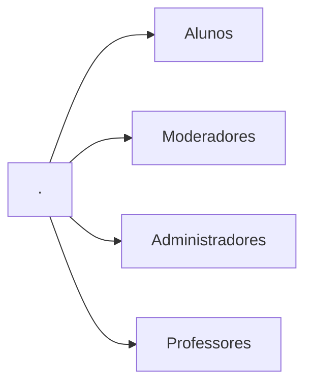
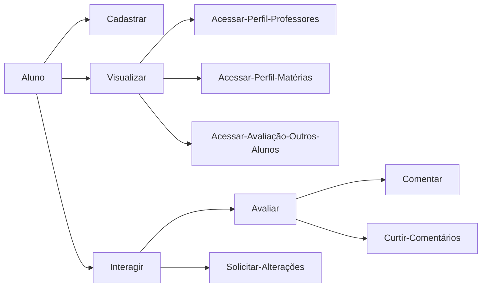
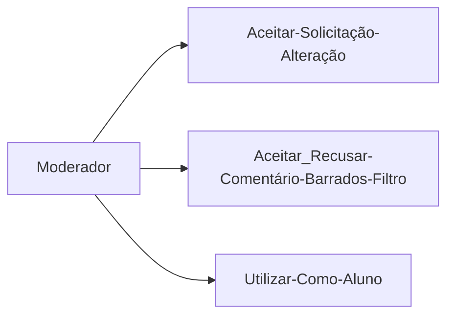
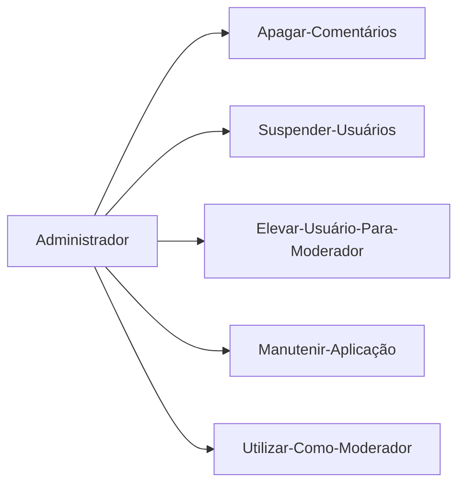
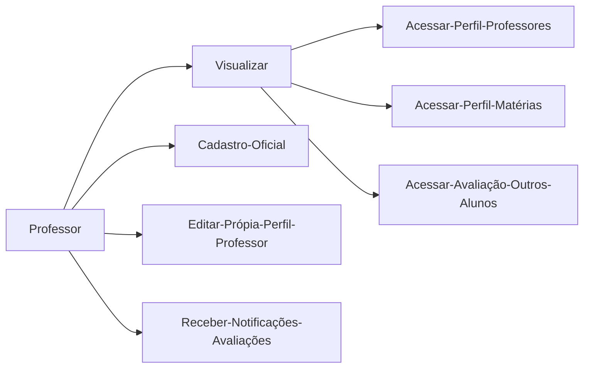

# Usage

1. Change or remove the persisted volume location of `db` inside `compose.yml`
2. Run `docker compose up``

# Diagramas de Casos de Uso

---

---

---

---

---

# Funcionalidades da Aplicação

- Pesquisar professores

  - Encontrar próximos professores de respectiva disciplina

  - Visualizar notas dos professores

    - Nota principal - Média das avaliações dos ultimos seis meses

    - Nota geral - Média das avaliações de todos os tempos

  - Visualizar perfil do professor

    - Disciplinas do semestre atual

    - Disciplinas do próximo semestre

    - Breve resumo do professor

- Avaliar professores

  - Notas de 1-5

  - Comentários públicos no perfil de professores

- Avaliar comentário de outros usuários

  - Upvote

  - Downvote

  - Denunciar

    - Caso de ofensas barbarizadas

      - Além disso comentários serão filtrados

- Solicitar alteração em perfil de professores

  - Alterar breve resumo

    - Em caso de perfil professor não oficial

  - Indicar disciplinas

    - Semestre atual

    - Próximo semestre

- Cadastro

  - Validar usuário aluno

    - Via email `ufu@br`

  - Validar moderador

    - Via comprovante de mátricula

    - Convite de outros moderadores

  - Validar administradores

    - Convite

  - Validar professores

    - Cadastro somente por solicitação via email
